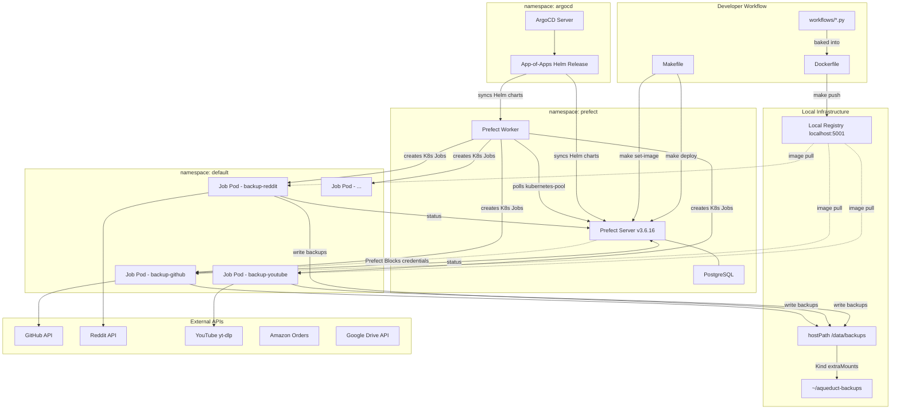

# Kubernetes & ArgoCD Infrastructure

GitOps-based Kubernetes deployment using ArgoCD and Helm charts. Works with both cloud-managed Kubernetes (EKS, GKE, AKS) and local clusters (Kind, Minikube).



## Table of Contents

- [Directory Structure](#directory-structure)
- [Local Prefect Deployment](#local-prefect-deployment)
  - [Prerequisites](#prerequisites)
  - [Quick Start](#quick-start)
  - [Architecture](#architecture)
  - [Credentials](#credentials)
  - [Makefile Targets](#makefile-targets)
  - [Updating Workflow Code](#updating-workflow-code)
  - [Adding a New Workflow](#adding-a-new-workflow)
  - [Accessing Backup Data](#accessing-backup-data)
  - [Image Tagging](#image-tagging)
  - [Known Limitations](#known-limitations)
  - [References](#references)
- [App-of-Apps Pattern](#app-of-apps-pattern)
  - [How the Templates Work](#how-the-templates-work)
  - [Adding to App-of-Apps](#adding-to-app-of-apps)
  - [Adding a New Application](#adding-a-new-application)
- [Administration Guide](#administration-guide)
  - [ArgoCD CLI Setup](#argocd-cli-setup)
  - [Common ArgoCD Commands](#common-argocd-commands)
  - [Common kubectl Commands](#common-kubectl-commands)
  - [Debugging Deployments](#debugging-deployments)
- [Environment Configuration](#environment-configuration)
- [Managing Secrets](#managing-secrets)
- [Troubleshooting](#troubleshooting)

---

## Directory Structure

```
k8s/
├── apps/
│   ├── app-of-apps/           # Parent application managing all others
│   │   ├── Chart.yaml
│   │   ├── templates/
│   │   │   └── helm-apps.yaml # Template creating ArgoCD Applications
│   │   ├── prod.yaml          # Production environment config
│   │   └── test.yaml          # Test environment config
│   │
│   ├── common/                # Shared configurations
│   │   ├── manifests/
│   │   │   ├── misc/          # Namespace, RBAC, storage classes, etc.
│   │   │   └── secrets/       # Sealed secrets (encrypted)
│   │   ├── remote-helm-repos/ # External Helm chart references
│   │   ├── prod-manifests/    # Production-specific configs
│   │   └── test-manifests/    # Test-specific configs
│   │
│   └── example-app/           # Template for new applications
│       ├── Chart.yaml
│       ├── values.yaml
│       ├── values-test.yaml
│       └── templates/
│           ├── deployment.yaml
│           ├── service.yaml
│           ├── ingress.yaml
│           ├── serviceaccount.yaml
│           ├── configmap.yaml
│           ├── secrets.yaml
│           └── servicemonitor.yaml
├── scripts/
│   └── new-app.sh             # Script to scaffold new apps
└── README.md

infra/kind/
├── kind-config.yaml           # Kind cluster config (registry + hostPath)
├── setup-cluster.sh           # Create cluster + registry + ArgoCD
└── teardown-cluster.sh        # Tear down everything
```

---

## Local Prefect Deployment

Run Aqueduct's Prefect workflows on a local Kind cluster with a local container registry and ArgoCD managing deployments.

### Prerequisites

- Docker (Colima or Docker Desktop)
- [kind](https://kind.sigs.k8s.io/) (installed by `infra/bootstrap-server.sh`)
- [kubectl](https://kubernetes.io/docs/tasks/tools/) (installed by `infra/bootstrap-server.sh`)
- [Helm](https://helm.sh/docs/intro/install/) (`brew install helm`)
- [ArgoCD CLI](https://argo-cd.readthedocs.io/en/stable/cli_installation/) (installed by `infra/bootstrap-server.sh`)

### Quick Start

```bash
# 1. Create the Kind cluster + local registry + ArgoCD
make cluster-up

# 2. Apply the prefect namespace
kubectl apply -f infra/k8s/apps/common/manifests/misc/prefect-namespace.yaml
kubectl apply -f infra/k8s/apps/common/manifests/misc/prefect-worker-rbac.yaml

# 3. Deploy Prefect server + worker via ArgoCD
make argocd-deploy

# 4. Wait for Prefect pods to be ready
kubectl wait --for=condition=ready --timeout=300s pod -l app.kubernetes.io/name=prefect-server -n prefect

# 5. In a separate terminal, port-forward the Prefect UI
make port-forward-prefect

# 6. Build image, set work pool image, register blocks, deploy workflows
make setup
```

Prefect UI: http://localhost:4200
ArgoCD UI: https://localhost:8080 (run `make port-forward-argocd`)

### Architecture

```
Kind Cluster ("aqueduct")
├── argocd namespace
│   └── ArgoCD (manages everything via app-of-apps)
├── prefect namespace
│   ├── Prefect Server (Helm chart) + PostgreSQL
│   └── Prefect Worker (Helm chart, polls kubernetes-pool)
├── default namespace
│   └── Workflow Jobs (created by worker, 1 pod per flow run)
└── hostPath: /data/backups → host ~/aqueduct-backups

Local Registry (localhost:5001)
└── aqueduct-workflows:<git-hash>-<timestamp>
```

| Component | Location | Purpose |
|-----------|----------|---------|
| Kind cluster | Docker containers | Kubernetes runtime |
| Local registry | `localhost:5001` | Container image storage |
| ArgoCD | `argocd` namespace | GitOps deployment management |
| Prefect Server | `prefect` namespace | Workflow orchestration + UI |
| PostgreSQL | `prefect` namespace | Prefect metadata storage |
| Prefect Worker | `prefect` namespace | Polls work pool, creates Jobs |
| Workflow Jobs | `default` namespace | Actual workflow execution (1 pod per flow run) |

**Data flow:**

1. Workflow code is built into `localhost:5001/aqueduct-workflows:<tag>`
2. Deployments are registered with Prefect server via `prefect deploy`
3. When triggered, Prefect worker creates a K8s Job using the image
4. The Job pod mounts `/data/backups` via hostPath (configured in the work pool base job template)
5. Backup data flows: Pod → hostPath mount → Kind node `/data/backups` → Host `~/aqueduct-backups`

### Credentials

Credentials are managed via Prefect Blocks (stored in PostgreSQL inside the cluster). To register blocks:

```bash
# Port-forward must be running
make register-blocks
```

This runs the block registration scripts against the Prefect API at `localhost:4200`.

### Makefile Targets

```bash
make cluster-up          # Create Kind cluster + registry + ArgoCD
make cluster-down        # Tear down everything
make build               # Build Docker image
make push                # Build + push to local registry (tagged + latest)
make set-image           # Update work pool default image to current tag
make deploy              # Deploy all workflows to Prefect
make setup               # Full setup (push + set-image + blocks + deploy)
make port-forward-prefect # Access Prefect UI at localhost:4200
make port-forward-argocd  # Access ArgoCD UI at localhost:8080
make register-blocks     # Register credential blocks
make create-work-pool    # Create kubernetes-pool work pool
make argocd-deploy       # Install app-of-apps Helm chart
make argocd-password     # Get ArgoCD admin password
make logs-server         # Tail Prefect server logs
make logs-worker         # Tail Prefect worker logs
make status              # Show cluster, registry, pods status
make test-registry       # Check what's in the local registry
```

### Updating Workflow Code

After modifying workflow files:

```bash
# Rebuild, push, and update work pool image
make push
make set-image

# Re-deploy to Prefect (if entrypoints changed)
make deploy
```

If only the code inside a flow changed (not entrypoints/names), just `make push && make set-image` is enough — the next Job will pull the updated image.

### Adding a New Workflow

1. Create the workflow file in `workflows/`
2. Add a deployment entry to `prefect.yaml`
3. `make push && make set-image && make deploy`

### Accessing Backup Data

Backup data written by workflow pods is available on the host at:

```
~/aqueduct-backups/
├── github/
├── reddit/
├── youtube/
└── ...
```

### Image Tagging

Images are tagged with `<short-git-hash>-<YYYYMMDDHHmmss>` (e.g. `4210bc0-20260209193000`). Both the specific tag and `:latest` are pushed to the local registry. `make set-image` updates the work pool's default image to the specific tagged version.

### Known Limitations

- **Google Drive OAuth**: Token must be pre-generated on host
- **Base job template**: hostPath mount and default image must be configured in the work pool after creation (done by `make set-image`)
- **hostPath is local-only**: wouldn't translate to a multi-node cluster
- **Single node**: all pods (server, worker, jobs) run on the same Kind node

### References

- [Kind local registry docs](https://kind.sigs.k8s.io/docs/user/local-registry/)
- [Prefect Helm charts](https://github.com/PrefectHQ/prefect-helm)
- [Prefect Kubernetes deployment guide](https://docs.prefect.io/v3/how-to-guides/deployment_infra/kubernetes)
- [Prefect server + worker tutorial](https://docs.prefect.io/v3/tutorials/server-and-worker)

---

## App-of-Apps Pattern

### How the Templates Work

The `app-of-apps` is a Helm chart that generates ArgoCD Application resources. When deployed, it creates child Applications that ArgoCD then manages.

**Flow:**
1. `helm-apps.yaml` template iterates over `.Values.apps` in prod.yaml/test.yaml
2. For each app, it creates an ArgoCD `Application` resource
3. ArgoCD watches these Applications and syncs them from their source (git or helm repo)

**helm-apps.yaml key sections:**

```yaml
# For remote Helm charts (e.g., prefect-server, prometheus):
{{- if hasKey $app "chart" }}
chart: {{ $app.chart }}
repoURL: {{ $app.repoURL }}
targetRevision: {{ $app.targetRevision }}

# For git-based Helm charts (your own apps):
{{- else }}
path: {{ $app.path }}
repoURL: {{ $app.repoURL | default "git@github.com:your-org/repo.git" }}
```

### Adding to App-of-Apps

**For a local Helm chart:**
```yaml
apps:
  - name: my-service
    path: infra/k8s/apps/my-service    # Path in git repo
    namespace: default
    # valueFile: values-test.yaml      # Optional: override values file
```

**For a remote Helm chart:**
```yaml
repos:
  - name: bitnami
    url: https://charts.bitnami.com/bitnami

apps:
  - name: redis
    chart: redis                        # Chart name
    repoURL: https://charts.bitnami.com/bitnami
    targetRevision: "17.0.0"           # Chart version
    namespace: default
    values: |                          # Inline values
      replica:
        replicaCount: 3
```

### Adding a New Application

**Option 1: Use the Script**

```bash
# Create a new local app from template
./scripts/new-app.sh my-new-service

# Add a remote helm chart reference
./scripts/new-app.sh --remote redis bitnami https://charts.bitnami.com/bitnami 17.0.0
```

**Option 2: Manual**

1. Copy `apps/example-app` to `apps/your-app-name`
2. Update `Chart.yaml` with your app name
3. Configure `values.yaml` with your app settings
4. Add the app to `app-of-apps/prod.yaml` and/or `test.yaml`

---

## Administration Guide

### ArgoCD CLI Setup

```bash
# Install ArgoCD CLI (macOS)
brew install argocd

# Get initial admin password
kubectl -n argocd get secret argocd-initial-admin-secret -o jsonpath="{.data.password}" | base64 -d && echo

# Port forward to access ArgoCD
kubectl port-forward svc/argocd-server -n argocd 8080:443

# Login via CLI
argocd login localhost:8080 --username admin --password <password> --insecure
```

### Common ArgoCD Commands

```bash
# List all applications
argocd app list

# Get application status
argocd app get <app-name>

# Sync an application (deploy changes)
argocd app sync <app-name>

# Force sync (ignore differences)
argocd app sync <app-name> --force

# View application logs
argocd app logs <app-name>

# View application history
argocd app history <app-name>

# Rollback to previous version
argocd app rollback <app-name> <history-id>

# Delete an application
argocd app delete <app-name>

# Refresh application (re-read from git)
argocd app get <app-name> --refresh
```

### Common kubectl Commands

```bash
# View all resources in a namespace
kubectl get all -n <namespace>

# View pods and their status
kubectl get pods -n <namespace>
kubectl get pods -n <namespace> -o wide  # with node info

# View pod logs
kubectl logs <pod-name> -n <namespace>
kubectl logs <pod-name> -n <namespace> -f  # follow logs
kubectl logs <pod-name> -n <namespace> --previous  # previous container

# Describe a resource (troubleshooting)
kubectl describe pod <pod-name> -n <namespace>
kubectl describe deployment <deployment-name> -n <namespace>

# Execute command in a pod
kubectl exec -it <pod-name> -n <namespace> -- /bin/sh

# Port forward to a service
kubectl port-forward svc/<service-name> -n <namespace> <local-port>:<service-port>

# View events (useful for debugging)
kubectl get events -n <namespace> --sort-by='.lastTimestamp'

# View resource usage
kubectl top pods -n <namespace>
kubectl top nodes
```

### Debugging Deployments

```bash
# Check why pods aren't starting
kubectl describe pod <pod-name> -n <namespace>

# Check deployment rollout status
kubectl rollout status deployment/<deployment-name> -n <namespace>

# View deployment history
kubectl rollout history deployment/<deployment-name> -n <namespace>

# Rollback a deployment
kubectl rollout undo deployment/<deployment-name> -n <namespace>

# Scale a deployment
kubectl scale deployment/<deployment-name> --replicas=3 -n <namespace>
```

---

## Environment Configuration

| File | Purpose |
|------|---------|
| `prod.yaml` | Production: full monitoring, HA, production secrets |
| `test.yaml` | Test/staging: reduced resources, test configs |
| `values.yaml` | App defaults |
| `values-test.yaml` | Per-app test overrides |

---

## Managing Secrets

Use [kubeseal](https://github.com/bitnami-labs/sealed-secrets) for encrypting secrets:

```bash
# Install sealed-secrets controller
helm repo add sealed-secrets https://bitnami-labs.github.io/sealed-secrets
helm install sealed-secrets sealed-secrets/sealed-secrets -n kube-system

# Seal a secret
kubectl create secret generic my-secret --dry-run=client -o yaml \
  --from-literal=API_KEY=secret-value | kubeseal --format yaml > sealed-secret.yaml
```

---

## Troubleshooting

### Pods stuck in ImagePullBackOff

The registry might not be connected to the Kind network:
```bash
docker network connect kind kind-registry
```

### Prefect worker can't connect to server

Check the server is running and the service exists:
```bash
kubectl get svc -n prefect
kubectl logs -n prefect -l app.kubernetes.io/name=prefect-worker
```

### Work pool not found

Create it manually:
```bash
make create-work-pool
```

### ArgoCD app not syncing

```bash
# Check sync status
argocd app get <app-name>

# View sync errors
kubectl get application <app-name> -n argocd -o yaml

# Force refresh
argocd app get <app-name> --refresh --hard-refresh
```

### Pods not starting

```bash
# Check pod events
kubectl describe pod <pod-name> -n <namespace>

# Common issues:
# - ImagePullBackOff: Wrong image or no credentials
# - CrashLoopBackOff: App crashing, check logs
# - Pending: No nodes available or resource constraints
```

### Registry not reachable

```bash
docker ps | grep kind-registry
curl localhost:5001/v2/_catalog
```

### Pod can't access backup directory

Ensure the Kind node has the mount:
```bash
docker exec aqueduct-control-plane ls /data/backups
```

Check that `~/aqueduct-backups` exists on the host.

### Helm template errors

```bash
# Test template rendering locally
helm template ./apps/my-app -f ./apps/my-app/values.yaml

# With debug output
helm template ./apps/my-app --debug
```
